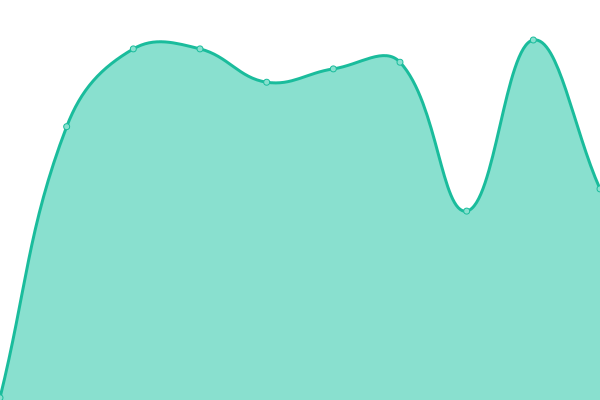

# [📈 Live Status](https://calponia.github.io/status-page-poc2): <!--live status--> **🟩 All systems operational**

This repository contains the open-source uptime monitor and status page for [CALPONIA by ETAS](https://pantaris.io), powered by [Upptime](https://github.com/upptime/upptime).

With [Upptime](https://upptime.js.org), you can get your own unlimited and free uptime monitor and status page, powered entirely by a GitHub repository. We use [Issues](https://github.com/calponia/status-page-poc2/issues) as incident reports, [Actions](https://github.com/calponia/status-page-poc2/actions) as uptime monitors, and [Pages](https://calponia.github.io/status-page-poc2) for the status page.

<!--start: status pages-->
<!-- This summary is generated by Upptime (https://github.com/upptime/upptime) -->
<!-- Do not edit this manually, your changes will be overwritten -->
<!-- prettier-ignore -->
| URL | Status | History | Response Time | Uptime |
| --- | ------ | ------- | ------------- | ------ |
|  [Login & user settings](https://my.cloudhub.etas.com) | 🟩 Up | [login-and-user-settings.yml](https://github.com/calponia/status-page/commits/HEAD/history/login-and-user-settings.yml) | 

 622ms
     
 | 

<a href="https://status.cloudhub.etas.com/history/login-and-user-settings">100.00%</a>
    

|  [Projects (legacy)](https://platform.cloudhub.etas.com) | 🟩 Up | [projects-legacy.yml](https://github.com/calponia/status-page/commits/HEAD/history/projects-legacy.yml) | 

 577ms
     
 | 

<a href="https://status.cloudhub.etas.com/history/projects-legacy">100.00%</a>
    

|  [Projects](https://project.cloudhub.etas.com) | 🟩 Up | [projects.yml](https://github.com/calponia/status-page/commits/HEAD/history/projects.yml) | 

 575ms
     
 | 

<a href="https://status.cloudhub.etas.com/history/projects">100.00%</a>
    

|  [Organizations](https://organization.cloudhub.etas.com) | 🟩 Up | [organizations.yml](https://github.com/calponia/status-page/commits/HEAD/history/organizations.yml) | 

 498ms
     
 | 

<a href="https://status.cloudhub.etas.com/history/organizations">100.00%</a>
    

|  [Creator](https://portal.cloudhub.etas.com) | 🟩 Up | [creator.yml](https://github.com/calponia/status-page/commits/HEAD/history/creator.yml) | 

 416ms
     
 | 

<a href="https://status.cloudhub.etas.com/history/creator">100.00%</a>
    

|  [Service catalog](https://marketplace.cloudhub.etas.com) | 🟩 Up | [service-catalog.yml](https://github.com/calponia/status-page/commits/HEAD/history/service-catalog.yml) | 

 471ms
     
 | 

<a href="https://status.cloudhub.etas.com/history/service-catalog">100.00%</a>
    

|  [Documentation](https://documentation.cloudhub.etas.com) | 🟩 Up | [documentation.yml](https://github.com/calponia/status-page/commits/HEAD/history/documentation.yml) | 

 510ms
     
 | 

<a href="https://status.cloudhub.etas.com/history/documentation">100.00%</a>
    

|  [Calendar](https://calendar.cloudhub.etas.com/healthcheck) | 🟩 Up | [calendar.yml](https://github.com/calponia/status-page/commits/HEAD/history/calendar.yml) | 

 518ms
     
 | 

<a href="https://status.cloudhub.etas.com/history/calendar">100.00%</a>
    

|  [Policies](https://policies.cloudhub.etas.com) | 🟩 Up | [policies.yml](https://github.com/calponia/status-page/commits/HEAD/history/policies.yml) | 

 492ms
     
 | 

<a href="https://status.cloudhub.etas.com/history/policies">100.00%</a>
    

|  [Support](https://helpspot.calponia.com) | 🟩 Up | [support.yml](https://github.com/calponia/status-page/commits/HEAD/history/support.yml) | 

 472ms
     
 | 

<a href="https://status.cloudhub.etas.com/history/support">100.00%</a>
    

|  [Operations](https://management-v2.cloudhub.etas.com) | 🟩 Up | [operations.yml](https://github.com/calponia/status-page/commits/HEAD/history/operations.yml) | 

 495ms
     
 | 

<a href="https://status.cloudhub.etas.com/history/operations">100.00%</a>
    

|  [CDN](https://cdn.cloudhub.etas.com) | 🟩 Up | [cdn.yml](https://github.com/calponia/status-page/commits/HEAD/history/cdn.yml) | 

 428ms
     
 | 

<a href="https://status.cloudhub.etas.com/history/cdn">100.00%</a>
    

|  [Storage](https://status-gateway.cloudhub.etas.com/v1/status/blob-storage) | 🟩 Up | [storage.yml](https://github.com/calponia/status-page/commits/HEAD/history/storage.yml) | 

 458ms
     
 | 

<a href="https://status.cloudhub.etas.com/history/storage">100.00%</a>
    

|  [Upload & Webdav Service](https://upload.cloudhub.etas.com/healthcheck) | 🟩 Up | [upload-and-webdav-service.yml](https://github.com/calponia/status-page/commits/HEAD/history/upload-and-webdav-service.yml) | 

 429ms
     
 | 

<a href="https://status.cloudhub.etas.com/history/upload-and-webdav-service">100.00%</a>
    

|  [Download Service](https://download.cloudhub.etas.com/healthcheck) | 🟩 Up | [download-service.yml](https://github.com/calponia/status-page/commits/HEAD/history/download-service.yml) | 

 452ms
     
 | 

<a href="https://status.cloudhub.etas.com/history/download-service">100.00%</a>
    

|  [Version Control](https://status-gateway.cloudhub.etas.com/v1/status/gitserver) | 🟩 Up | [version-control.yml](https://github.com/calponia/status-page/commits/HEAD/history/version-control.yml) | 

 120ms
     
 | 

<a href="https://status.cloudhub.etas.com/history/version-control">100.00%</a>
    

|  [Statistics](https://status-gateway.cloudhub.etas.com/v1/status/statistics) | 🟩 Up | [statistics.yml](https://github.com/calponia/status-page/commits/HEAD/history/statistics.yml) | 

 124ms
     
 | 

<a href="https://status.cloudhub.etas.com/history/statistics">100.00%</a>
    

|  [Notifications](https://status-gateway.cloudhub.etas.com/v1/status/notification-hub) | 🟩 Up | [notifications.yml](https://github.com/calponia/status-page/commits/HEAD/history/notifications.yml) | 

 130ms
     
 | 

<a href="https://status.cloudhub.etas.com/history/notifications">100.00%</a>
    

|  [SCIM API](https://status-gateway.cloudhub.etas.com/v1/status/scim-api-interface) | 🟩 Up | [scim-api.yml](https://github.com/calponia/status-page/commits/HEAD/history/scim-api.yml) | 

 129ms
     
 | 

<a href="https://status.cloudhub.etas.com/history/scim-api">100.00%</a>
    

|  [Fleet Archive Exporter](https://status-gateway.cloudhub.etas.com/v1/status/fleet-exporter) | 🟩 Up | [fleet-archive-exporter.yml](https://github.com/calponia/status-page/commits/HEAD/history/fleet-archive-exporter.yml) | 

 147ms
     
 | 

<a href="https://status.cloudhub.etas.com/history/fleet-archive-exporter">100.00%</a>
    

|  [Container services - General](https://status-gateway.cloudhub.etas.com/v1/status/app-operator) | 🟩 Up | [container-services-general.yml](https://github.com/calponia/status-page/commits/HEAD/history/container-services-general.yml) | 

 288ms
     
 | 

<a href="https://status.cloudhub.etas.com/history/container-services-general">100.00%</a>
    

|  [Container services - Build](https://status-gateway.cloudhub.etas.com/v1/status/apphandler) | 🟩 Up | [container-services-build.yml](https://github.com/calponia/status-page/commits/HEAD/history/container-services-build.yml) | 

 124ms
     
 | 

<a href="https://status.cloudhub.etas.com/history/container-services-build">99.93%</a>
    

|  [Container services - Startup](https://service-startup.cloudhub.etas.com) | 🟩 Up | [container-services-startup.yml](https://github.com/calponia/status-page/commits/HEAD/history/container-services-startup.yml) | 

 407ms
     
 | 

<a href="https://status.cloudhub.etas.com/history/container-services-startup">100.00%</a>
    

|  [Container services - External Traffic](http://0ca2d4b8f342a21cfb6de71d1d1c46b4.ext.cloudhub.etas.com:3001/) | 🟩 Up | [container-services-external-traffic.yml](https://github.com/calponia/status-page/commits/HEAD/history/container-services-external-traffic.yml) | 

 311ms
     
 | 

<a href="https://status.cloudhub.etas.com/history/container-services-external-traffic">99.93%</a>
    

|  [Container services - Registry](https://docker.cloudhub.etas.com) | 🟩 Up | [container-services-registry.yml](https://github.com/calponia/status-page/commits/HEAD/history/container-services-registry.yml) | 

 403ms
     
 | 

<a href="https://status.cloudhub.etas.com/history/container-services-registry">100.00%</a>
    

|  [Container services - Dashboard](https://status-gateway.cloudhub.etas.com/v1/status/dashboard) | 🟩 Up | [container-services-dashboard.yml](https://github.com/calponia/status-page/commits/HEAD/history/container-services-dashboard.yml) | 

 124ms
     
 | 

<a href="https://status.cloudhub.etas.com/history/container-services-dashboard">100.00%</a>
    

|  [API v2](https://api.cloudhub.etas.com/v2/healthcheck) | 🟩 Up | [api-v2.yml](https://github.com/calponia/status-page/commits/HEAD/history/api-v2.yml) | 

 451ms
     
 | 

<a href="https://status.cloudhub.etas.com/history/api-v2">100.00%</a>
    

|  [API Public Gateway](https://api.cloudhub.etas.com/v3-preview/internal/health) | 🟩 Up | [api-public-gateway.yml](https://github.com/calponia/status-page/commits/HEAD/history/api-public-gateway.yml) | 

 128ms
     
 | 

<a href="https://status.cloudhub.etas.com/history/api-public-gateway">100.00%</a>
    

|  [Windows application streaming](https://status-gateway.cloudhub.etas.com/v1/status/appstream) | 🟩 Up | [windows-application-streaming.yml](https://github.com/calponia/status-page/commits/HEAD/history/windows-application-streaming.yml) | 

 200ms
     
 | 

<a href="https://status.cloudhub.etas.com/history/windows-application-streaming">100.00%</a>
    

|  [IAM](https://status-gateway.cloudhub.etas.com/v1/status/ciam) | 🟩 Up | [iam.yml](https://github.com/calponia/status-page/commits/HEAD/history/iam.yml) | 

 125ms
     
 | 

<a href="https://status.cloudhub.etas.com/history/iam">100.00%</a>
    

|  [3rd Party IAM](https://status-gateway.cloudhub.etas.com/v1/status/third-party-iam) | 🟩 Up | [3rd-party-iam.yml](https://github.com/calponia/status-page/commits/HEAD/history/3rd-party-iam.yml) | 

 141ms
     
 | 

<a href="https://status.cloudhub.etas.com/history/3rd-party-iam">100.00%</a>
    

|  [User account inactivity](https://status-gateway.cloudhub.etas.com/v1/status/user-inactivity) | 🟩 Up | [user-account-inactivity.yml](https://github.com/calponia/status-page/commits/HEAD/history/user-account-inactivity.yml) | 

 123ms
     
 | 

<a href="https://status.cloudhub.etas.com/history/user-account-inactivity">100.00%</a>
    

|  [Message Bus](https://status-gateway.cloudhub.etas.com/v1/status/management-rabbitmq) | 🟩 Up | [message-bus.yml](https://github.com/calponia/status-page/commits/HEAD/history/message-bus.yml) | 

 125ms
     
 | 

<a href="https://status.cloudhub.etas.com/history/message-bus">100.00%</a>
    

|  [Open API Explorer](https://openapi.cloudhub.etas.com) | 🟩 Up | [open-api-explorer.yml](https://github.com/calponia/status-page/commits/HEAD/history/open-api-explorer.yml) | 

 414ms
     
 | 

<a href="https://status.cloudhub.etas.com/history/open-api-explorer">100.00%</a>
    

|  [Async API Explorer](https://asyncapi.cloudhub.etas.com) | 🟩 Up | [async-api-explorer.yml](https://github.com/calponia/status-page/commits/HEAD/history/async-api-explorer.yml) | 

 387ms
     
 | 

<a href="https://status.cloudhub.etas.com/history/async-api-explorer">100.00%</a>
    

|  [Async API Specification](https://data-events.cloudhub.etas.com/v2/explorer/) | 🟩 Up | [async-api-specification.yml](https://github.com/calponia/status-page/commits/HEAD/history/async-api-specification.yml) | 

 894ms
     
 | 

<a href="https://status.cloudhub.etas.com/history/async-api-specification">100.00%</a>
    

|  [Logs - Monitoring](https://status-gateway.cloudhub.etas.com/v1/status/logs) | 🟩 Up | [logs-monitoring.yml](https://github.com/calponia/status-page/commits/HEAD/history/logs-monitoring.yml) | 

 195ms
     
 | 

<a href="https://status.cloudhub.etas.com/history/logs-monitoring">100.00%</a>
    

|  [Logs - UI](https://status-gateway.cloudhub.etas.com/v1/status/kibana) | 🟩 Up | [logs-ui.yml](https://github.com/calponia/status-page/commits/HEAD/history/logs-ui.yml) | 

 245ms
     
 | 

<a href="https://status.cloudhub.etas.com/history/logs-ui">100.00%</a>
    

|  [Metrics - Monitoring](https://grafana.mon.cloudhub.etas.com) | 🟩 Up | [metrics-monitoring.yml](https://github.com/calponia/status-page/commits/HEAD/history/metrics-monitoring.yml) | 

 383ms
     
 | 

<a href="https://status.cloudhub.etas.com/history/metrics-monitoring">100.00%</a>
    

<!--end: status pages-->

[**Visit our status website →**](https://calponia.github.io/status-page-poc2)

## 📄 License

- Powered by: [Upptime](https://github.com/upptime/upptime)
- Code: [MIT](./LICENSE) © [Anand Chowdhary](https://anandchowdhary.com), supported by [Pabio](https://pabio.com)
- Data in the `./history` directory: [Open Database License](https://opendatacommons.org/licenses/odbl/1-0/)
