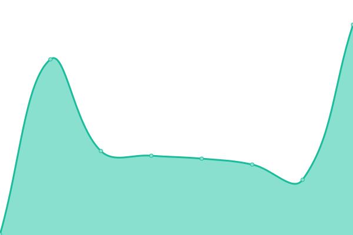
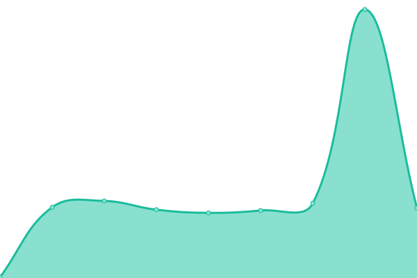

# [📈 Live Status](https://calponia.github.io/status-page-poc2): <!--live status--> **🟩 All systems operational**

This repository contains the open-source uptime monitor and status page for [CALPONIA by ETAS](https://pantaris.io), powered by [Upptime](https://github.com/upptime/upptime).

With [Upptime](https://upptime.js.org), you can get your own unlimited and free uptime monitor and status page, powered entirely by a GitHub repository. We use [Issues](https://github.com/calponia/status-page-poc2/issues) as incident reports, [Actions](https://github.com/calponia/status-page-poc2/actions) as uptime monitors, and [Pages](https://calponia.github.io/status-page-poc2) for the status page.

<!--start: status pages-->
<!-- This summary is generated by Upptime (https://github.com/upptime/upptime) -->
<!-- Do not edit this manually, your changes will be overwritten -->
<!-- prettier-ignore -->
| URL | Status | History | Response Time | Uptime |
| --- | ------ | ------- | ------------- | ------ |
|  [Login & user settings](https://my.pantaris.io) | 🟩 Up | [login-and-user-settings.yml](https://github.com/calponia/status-page/commits/HEAD/history/login-and-user-settings.yml) | 

 189ms
     
 | 

<a href="https://status.pantaris.io/history/login-and-user-settings">100.00%</a>
    

|  [Projects](https://platform.pantaris.io) | 🟩 Up | [projects.yml](https://github.com/calponia/status-page/commits/HEAD/history/projects.yml) | 

 153ms
     
 | 

<a href="https://status.pantaris.io/history/projects">100.00%</a>
    

|  [Projects v2 (experimental)](https://project.pantaris.io) | 🟩 Up | [projects-v2-experimental.yml](https://github.com/calponia/status-page/commits/HEAD/history/projects-v2-experimental.yml) | 

 125ms
     
 | 

<a href="https://status.pantaris.io/history/projects-v2-experimental">100.00%</a>
    

|  [Organizations](https://organization.pantaris.io) | 🟩 Up | [organizations.yml](https://github.com/calponia/status-page/commits/HEAD/history/organizations.yml) | 

 149ms
     
 | 

<a href="https://status.pantaris.io/history/organizations">100.00%</a>
    

|  [Creator](https://portal.pantaris.io) | 🟩 Up | [creator.yml](https://github.com/calponia/status-page/commits/HEAD/history/creator.yml) | 

 153ms
     
 | 

<a href="https://status.pantaris.io/history/creator">100.00%</a>
    

|  [Marketplace](https://marketplace.pantaris.io) | 🟩 Up | [marketplace.yml](https://github.com/calponia/status-page/commits/HEAD/history/marketplace.yml) | 

 158ms
     
 | 

<a href="https://status.pantaris.io/history/marketplace">100.00%</a>
    

|  [Documentation](https://documentation.pantaris.io) | 🟩 Up | [documentation.yml](https://github.com/calponia/status-page/commits/HEAD/history/documentation.yml) | 

 162ms
     
 | 

<a href="https://status.pantaris.io/history/documentation">100.00%</a>
    

|  [Policies](https://policies.pantaris.io) | 🟩 Up | [policies.yml](https://github.com/calponia/status-page/commits/HEAD/history/policies.yml) | 

 151ms
     
 | 

<a href="https://status.pantaris.io/history/policies">100.00%</a>
    

|  [Support](https://helpspot.calponia.com) | 🟩 Up | [support.yml](https://github.com/calponia/status-page/commits/HEAD/history/support.yml) | 

 179ms
     
 | 

<a href="https://status.pantaris.io/history/support">100.00%</a>
    

|  [Forum](https://forum.pantaris.io) | 🟩 Up | [forum.yml](https://github.com/calponia/status-page/commits/HEAD/history/forum.yml) | 

 395ms
     
 | 

<a href="https://status.pantaris.io/history/forum">100.00%</a>
    

|  [Operations](https://management.pantaris.io) | 🟩 Up | [operations.yml](https://github.com/calponia/status-page/commits/HEAD/history/operations.yml) | 

 155ms
     
 | 

<a href="https://status.pantaris.io/history/operations">100.00%</a>
    

|  [CDN](https://cdn.pantaris.io) | 🟩 Up | [cdn.yml](https://github.com/calponia/status-page/commits/HEAD/history/cdn.yml) | 

 155ms
     
 | 

<a href="https://status.pantaris.io/history/cdn">100.00%</a>
    

|  [Upload & Webdav Service](https://upload.pantaris.io/healthcheck) | 🟩 Up | [upload-and-webdav-service.yml](https://github.com/calponia/status-page/commits/HEAD/history/upload-and-webdav-service.yml) | 

 2796ms
     
 | 

<a href="https://status.pantaris.io/history/upload-and-webdav-service">99.70%</a>
    

|  [Download Service](https://download.pantaris.io/healthcheck) | 🟩 Up | [download-service.yml](https://github.com/calponia/status-page/commits/HEAD/history/download-service.yml) | 

 160ms
     
 | 

<a href="https://status.pantaris.io/history/download-service">99.70%</a>
    

|  [Applications](https://healthcheck.app.pantaris.io) | 🟩 Up | [applications.yml](https://github.com/calponia/status-page/commits/HEAD/history/applications.yml) | 

 182ms
     
 | 

<a href="https://status.pantaris.io/history/applications">100.00%</a>
    

|  [External Traffic Service](http://0ca2d4b8f342a21cfb6de71d1d1c46b4.ext.pantaris.io:3001/) | 🟩 Up | [external-traffic-service.yml](https://github.com/calponia/status-page/commits/HEAD/history/external-traffic-service.yml) | 

 77ms
     
 | 

<a href="https://status.pantaris.io/history/external-traffic-service">100.00%</a>
    

|  [Docker Registry](https://docker.pantaris.io) | 🟩 Up | [docker-registry.yml](https://github.com/calponia/status-page/commits/HEAD/history/docker-registry.yml) | 

 92ms
     
 | 

<a href="https://status.pantaris.io/history/docker-registry">100.00%</a>
    

|  [API v2](https://api.pantaris.io/v2/healthcheck) | 🟩 Up | [api-v2.yml](https://github.com/calponia/status-page/commits/HEAD/history/api-v2.yml) | 

 197ms
     
 | 

<a href="https://status.pantaris.io/history/api-v2">99.70%</a>
    

|  [Message Bus](https://status-gateway.pantaris.io/v1/status/management-rabbitmq) | 🟩 Up | [message-bus.yml](https://github.com/calponia/status-page/commits/HEAD/history/message-bus.yml) | 

 99ms
     
 | 

<a href="https://status.pantaris.io/history/message-bus">100.00%</a>
    

|  [Logs Monitoring](https://status-gateway.pantaris.io/v1/status/kibana) | 🟩 Up | [logs-monitoring.yml](https://github.com/calponia/status-page/commits/HEAD/history/logs-monitoring.yml) | 

 40ms
     
 | 

<a href="https://status.pantaris.io/history/logs-monitoring">100.00%</a>
    

|  [Metrics Monitoring](https://grafana.mon.pantaris.io) | 🟩 Up | [metrics-monitoring.yml](https://github.com/calponia/status-page/commits/HEAD/history/metrics-monitoring.yml) | 

 163ms
     
 | 

<a href="https://status.pantaris.io/history/metrics-monitoring">99.70%</a>
    

<!--end: status pages-->

[**Visit our status website →**](https://calponia.github.io/status-page-poc2)

## 📄 License

- Powered by: [Upptime](https://github.com/upptime/upptime)
- Code: [MIT](./LICENSE) © [Anand Chowdhary](https://anandchowdhary.com), supported by [Pabio](https://pabio.com)
- Data in the `./history` directory: [Open Database License](https://opendatacommons.org/licenses/odbl/1-0/)
